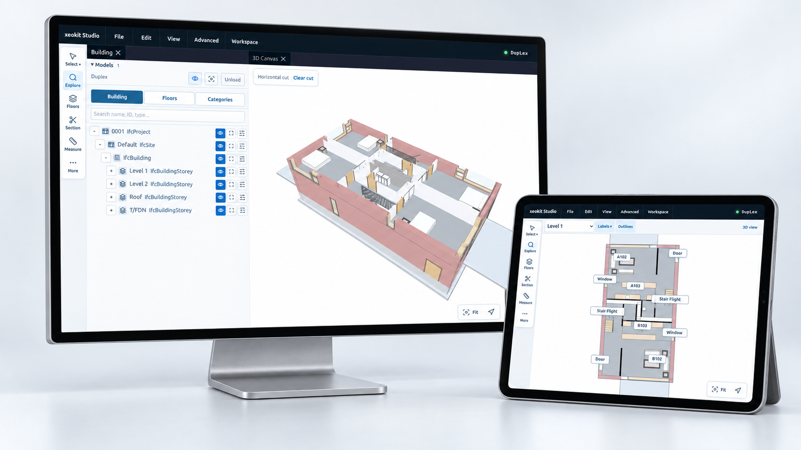
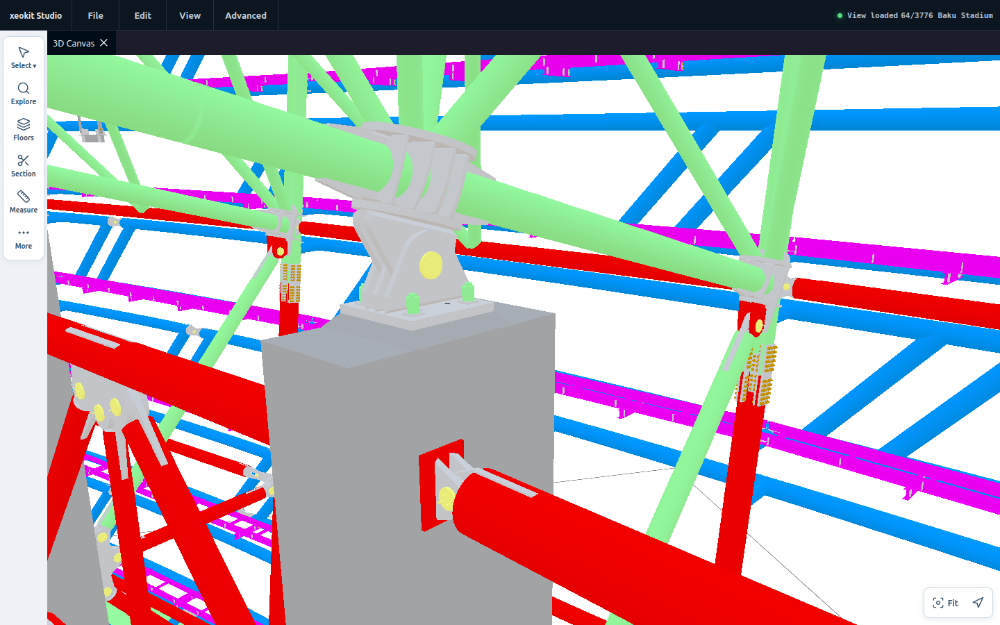

# xeokit Studio

xeokit Studio is a browser workspace for exploring architecture, engineering and
construction models, built with xeokit. Inspect building information, review
floor plans, take measurements and save useful views.

**[Open Studio](https://xeolabs.github.io/studio/)**

[](https://xeolabs.github.io/studio/)

[Desktop model review](docs/images/studio-desktop.png) · [Tablet floor plan](docs/images/studio-tablet.png)

## Explore

Studio opens with the bundled Duplex building. Import your own models from
**More → Import model**, or use the File menu.

| Tool | What you can do |
| --- | --- |
| **Explore** | Browse the building hierarchy, floors and element categories; search by name, type or ID. |
| **Properties** | Inspect an element's name, type, floor and searchable property sets. |
| **Floors** | Open a floor plan with adjustable cut height, outlines and labels that adapt to the available space. |
| **Section** | Make horizontal or vertical cuts, move the cutting plane and flip its direction. |
| **Measure** | Measure between two points with surface, edge and vertex snapping and an optional magnifying lens. |
| **Saved views** | Keep named thumbnails with the camera, floor, cuts, visibility and viewing effects. |

## Baku Stadium stream

[](https://xeolabs.github.io/studio/?models=baku&eye=-67.75803,116.28819,46.98897&look=-75.49979,118.42810,44.85021&up=-0.24801,0.06855,0.96633&fov=40)

**[Open this Baku viewpoint](https://xeolabs.github.io/studio/?models=baku&eye=-67.75803,116.28819,46.98897&look=-75.49979,118.42810,44.85021&up=-0.24801,0.06855,0.96633&fov=40)**

The SDK's Baku 4k XGF stream is bundled with Studio. Visible chunks load nearest
the camera first, together with their shared geometry assets. Loading pauses
while the camera moves and resumes 500 ms after it stops. Already loaded chunks
stay in the scene; a completed view makes no further chunk requests until you
move. Once every geometry chunk is resident and the renderer has caught up,
the model is sealed and streaming stops. Unloading cancels the stream.

Baku contains 3,776 geometry chunks and 244 shared asset chunks (about 226 MB
including indexes). The initial view downloads only the chunks it needs. This
stream includes geometry, without IFC property sets or a building hierarchy.

### Open bundled models by URL

Use catalogue IDs in `models`, separated by commas. With no `models` parameter,
Studio opens Duplex. `model` is also accepted for a single selection.

| Parameter | Value |
| --- | --- |
| `models` | `duplex`, `baku`, or `duplex,baku` |
| `eye` | Camera position as `x,y,z` |
| `look` | Camera target as `x,y,z` |
| `up` | Camera up direction as `x,y,z` |
| `fov` | Perspective field of view in degrees, from 1 to 175 |

Camera coordinates use the scene's world frame: Z-up and meters for these
bundled models. Omitted camera values use the first selected model's default
view. Unknown model IDs and invalid cameras display an error before loading.
Startup URLs select only models in the [bundled catalogue](src/studio/app/bundledModels.ts).

```text
?models=duplex
?models=baku
?models=duplex,baku&eye=-67.75803,116.28819,46.98897&look=-75.49979,118.42810,44.85021&up=-0.24801,0.06855,0.96633&fov=40
```

## Using Studio

Drag to orbit, scroll or pinch to zoom, and use two fingers to pan. Select an
element to inspect it; **Focus** frames it in the viewer. **Fit** brings the model
back into view. Desktop panels dock beside the canvas; tablet tools open in a
side panel that can be tucked away.

**Effects** provides visibility, X-ray, highlight and isolation controls for an
element or subtree. **Restore** returns from isolation. Undo and Redo recover
visibility and effect changes; **More → Show all elements** reveals the model.

In **Floors**, open a floor's subtree actions and choose **Plan**. The plan cut
starts 1.2 m above the inferred floor surface. Adjust its height in **Section**,
use **Labels** to choose a density, and toggle **Outlines** for clearer edges.
**3D view** returns to the previous viewing context.

With **Measure**, choose two points, or touch and slide to refine each endpoint.
Choose metres, millimetres, feet or inches. Plan measurements stay horizontal and
belong to their floor. Tap a measurement in the list to locate it; delete it with
the adjacent button, or use Undo to recover a deletion. **Done** or Escape exits
the tool.

Open **More → Saved views** to save, reopen, rename or delete a view. Views stay
in this browser across reloads and reappear when the same model set is loaded.
Imported models must be loaded again. Measurements are kept for the current
session and are removed when their source model is unloaded.

## Models and formats

Load models from local files or URLs. Format detection starts on **Auto** each
time the import dialog opens. Conflicting imports offer **Replace existing** or
**Cancel** before changing the current models. The Models list has Hide/Show,
Fit and Unload controls; unloading asks for confirmation.

| Data | Supported examples |
| --- | --- |
| Building models | IFC, XKT, XGF and .bim |
| 3D interchange | GLB, OBJ, FBX, USDZ, PLY and 3DXML |
| Point clouds and spatial data | LAS/LAZ, E57, 3D Tiles and Gaussian splats |
| xeokit data | SceneModel JSON and DataModel JSON, including geometry/metadata pairs |

**More → Export** writes selected models in a compatible format. XGF or Scene
JSON with Data JSON preserves linked geometry and metadata for a round trip;
other formats may change element IDs or omit unsupported information. The export
dialog describes each format's limitations.

The [import catalogue](src/studio/importing/IMPORT_DATA_SETS.ts) and
[export registry](src/studio/services/exporters/exportFormatRegistry.ts) list the
available formats. Some importers fetch decoder assets from a CDN. URL imports
require the source server to allow browser access.

## Graphics

Rendering, picking and measurement tools use the **xeokit SDK**. Studio tries
**WebGPU** first and falls back to **WebGL 2** when it is unavailable. Add
`?renderer=webgl` to the URL to select WebGL explicitly; renderer controls are
also available under **Advanced**.

WebGPU requires browser and GPU support and a secure context: HTTPS or localhost.
The screenshots show bundled models rendered with WebGL 2.

## Run locally

Use Node.js 20.19+ or 22.12+ and npm.

```sh
npm ci
npm run dev
```

Open the local URL printed by Vite.

```sh
npm test              # Studio regression tests
npm run typecheck     # TypeScript checks
npm run build         # Production site in dist/
npm run preview       # Preview the production build
```

Deploy `dist/` to a static HTTP server. Relative asset URLs support hosting under
a subdirectory.

## Development

The application lives in [`src/studio/`](src/studio/), with its entrypoint in
[`src/main.ts`](src/main.ts). The bundled models are in
[`public/models/`](public/models/), with [Baku dataset provenance](public/models/BakuStadium_xgfstream_4000/PROVENANCE.md). Regression tests are in
[`tests/`](tests/).

Studio includes an unreleased xeokit v3 source snapshot under
[`vendor/xeokit-sdk/`](vendor/xeokit-sdk/). Vite and TypeScript resolve the local
SDK directly, so a sibling SDK checkout is not required. Vue, UI styles and icons
are bundled locally.

To refresh the SDK, copy the upstream TypeScript source into
`vendor/xeokit-sdk/src`, update its provenance, and rerun the checks above. Keep
SDK tests, generated CLI bundles and source maps out of the snapshot, and retain
the compatibility fix described in its provenance notes.

[Code license](LICENSE.md) · [SDK snapshot and provenance](vendor/xeokit-sdk/PROVENANCE.md)
